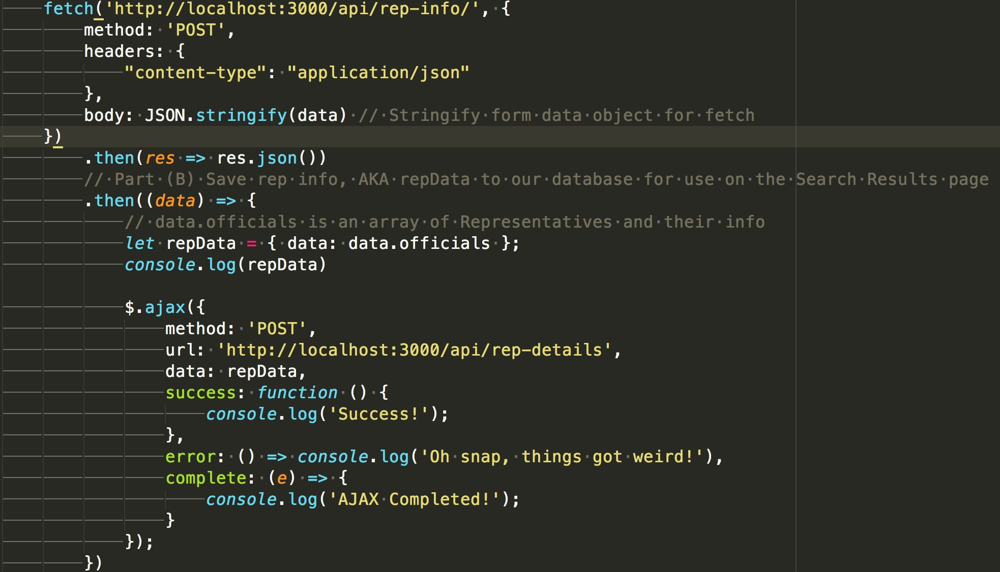
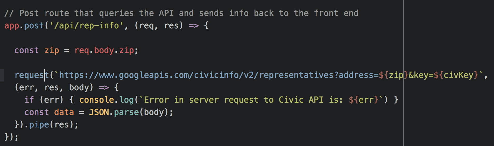
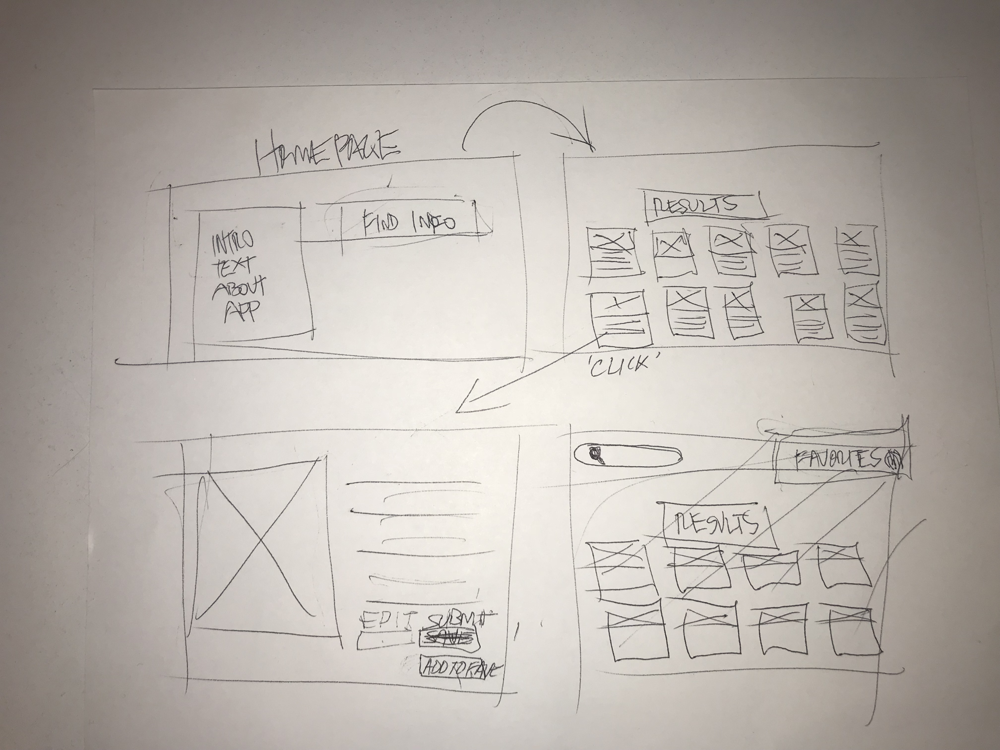
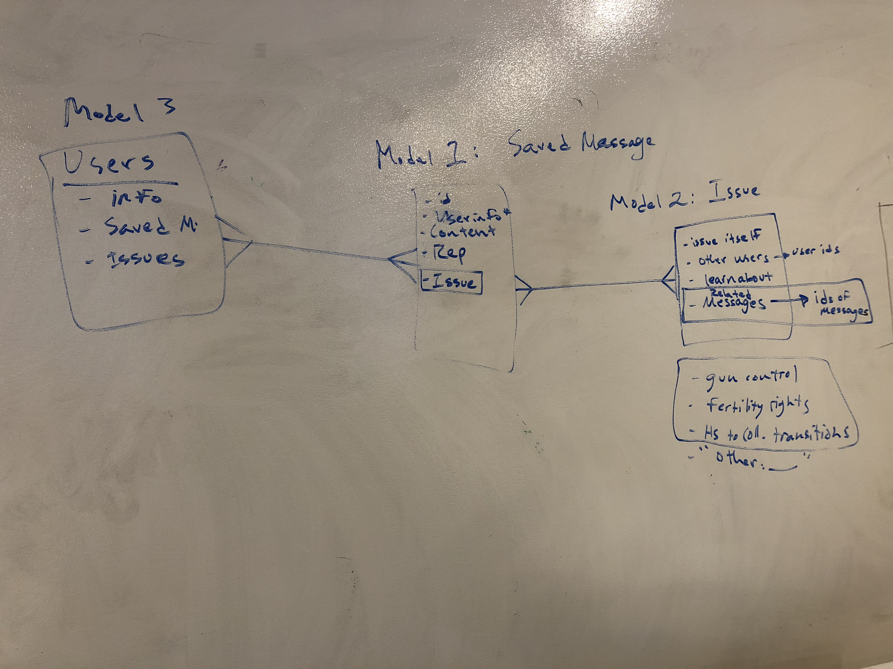

# Check Your Rep App

The goal of our project was enable user to find contact information and/ or send a message/s to their representatives.

## Technologies Used
 - HTMl, CSS, JavaScript, jQuery, Mongoose, Node, MongoDb, Express

### Existing Features
 - Google Civic API access
 - Server Side API request
 - C.R.U.D.
 - Front End Framework

### Planner Features
 - Users model
 - Pagination
 - Page re-directs
 - Enable user login/sign up
 - Authentication
 - Heroku- issues

### Wins/Challenges
 - Successfully utilize difficult API
 - Worked well collaboratively/Teamwork

 - Backend server request- annoying
    - Front End
    
    - Back End
    
 - Dynamic creation of REP cards
    

### Screenshots

